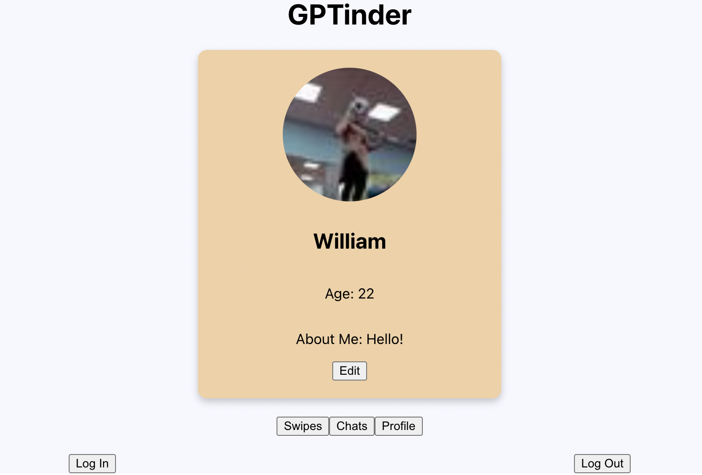

## DatingAppGPT
DatingAppGPT leverages the power of OpenAI's GPT to create a unique dating experience. Users can engage in natural language conversations, swipe through profiles, and enjoy real-time chat interactions.

### Quick Setup Guide
1. Clone the repository.
2. Run `npm install` in both the main folder and the backend folder.
3. Start the application with `npm start`.
4. Open [http://localhost:3000](http://localhost:3000) in your browser.

**Note:** Make sure to set up your OpenAI account and update the API key in the `.env` file.

## Things you'll need
- An OpenAI account with API tokens.
- Update the OpenAI API key in the `.env` file after each git push.
- Use the following login credentials for testing:
  - Role: loginUser
  - Password: password

